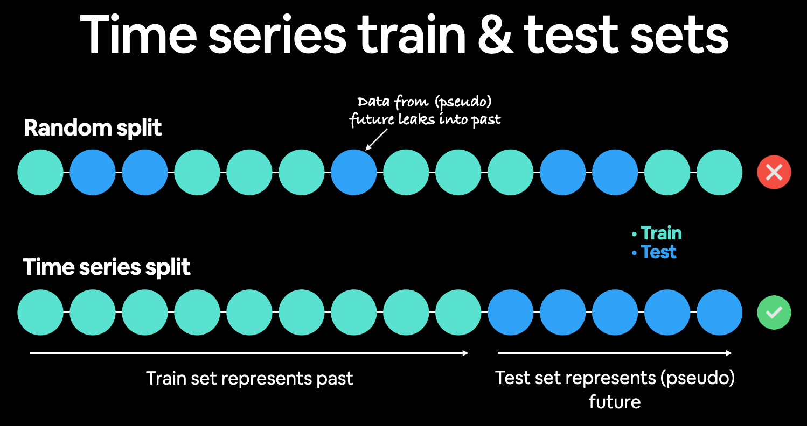

# holbertonschool-machine_learning
This is the repository for my machine_learning academic process

### Additional Resourses  :books:

#### Neural Networks Basics:
* Neuron explaniation:

* Backpropagation:

* [Backpropagation Step by Step:](https://hmkcode.com/ai/backpropagation-step-by-step/)

#### Classification:
* [Live Coding Session (LCS) for Classification](https://www.youtube.com/watch?v=8au-vRM0lXs)

#### Tensorflow:
* [Tensorflow - Eager Execution](./utils/tensorflow_eager_execution.pdf)
* [Recomended](https://youtu.be/UYRBHFAvLSs)

#### Error analysis:

* Confussion Matrix:

* [LCS for Error Analysis](https://www.youtube.com/watch?v=m8885xsjdq4)

* [better intuition about metrics](https://towardsdatascience.com/should-i-look-at-precision-recall-or-specificity-sensitivity-3946158aace1)

#### Regularization:
* [LCS for Regularization](https://www.youtube.com/watch?v=kcsRT832m5M)

#### Convolutions:

* [backpropagation in CNN](https://towardsdatascience.com/backpropagation-in-a-convolutional-layer-24c8d64d8509)

* [LCS for CNN](https://www.youtube.com/watch?v=SkkIIWC1BPo)

* [Backward Propagation of the Pooling Layers](https://lanstonchu.wordpress.com/2018/09/01/convolutional-neural-network-cnn-backward-propagation-of-the-pooling-layers/)

#### Deep CNNs:
* [Detailed explanation of ResNet](https://towardsdatascience.com/creating-deeper-bottleneck-resnet-from-scratch-using-tensorflow-93e11ff7eb02)

#### Transfer Learning:
* [LCS for TL](https://www.youtube.com/watch?v=xr46kbl2T8Q&t=2s)

#### Object detection:

* With an input image of size 416 × 416,
    we make detections on  3  scales :
        13 × 13
        26 × 26
        52 × 52
    

* The model produces a set of (t_x, t_y, t_w, t_h)
    where :
    (t_x, t_y) center box coordinates.
    (t_w, t_h) height and weight of the box.
    1/ you will have to compute new coordinates (b_x, b_y, b_w, b_h) using this :
    

* Normalization :
    - Divide b_x and b_y by the grid size.
    - Divide b_w, b_h by the model input size.
    2/ Compute (x1,y1) and (x2,y2)
    

* Non-maximun suppression:
    

* [Anchor boxes in Yolo](https://stackoverflow.com/questions/52710248/anchor-boxes-in-yolo-how-are-they-decided)

#### Neural Style Transfer:
* [LCS for NST intro](https://www.youtube.com/watch?v=QWw6OHv_f08)
* [Neural Style Transfer with Tensorflow](https://www.pluralsight.com/guides/implementing-artistic-neural-style-transfer-with-tensorflow-2.0)
* [LCS for NST tasks 0-1](https://www.youtube.com/watch?v=8-nu9QhJ6mk&t=1s)
* [LCS for NST tasks 2 - Oumaima Merhben](https://www.youtube.com/watch?v=mMvpEwVL1X8)
* [LCS for NST tasks 3-4](https://www.youtube.com/watch?v=1cBn71tvyZ8)
* [LCS Linalg Einsum](https://www.youtube.com/watch?v=WaGud90HoLA)
* [LCS for NST tasks 2 - Myriam Azzouz](https://youtu.be/Rq4Gi1KXjgc)

#### Bayesian Probability:
* Bayes Rule:
    

#### Clustering
* Expextation Maximization:
    

* Elbow Method:
    

* Log Likelihood:
    

* [The number of parameters in Gaussian mixture model](https://stats.stackexchange.com/questions/229293/the-number-of-parameters-in-gaussian-mixture-model/229321)

* [LCS for Clustering task 5](https://www.youtube.com/watch?v=Ro0nm-lEzPA&list=PLO2XvKtIjvgGUs7rTI6uiEhE22uZEW2Ll&index=3)

* [LCS for Clustering task 6](https://www.youtube.com/watch?v=KZP_mm_ZaZ8&list=PLO2XvKtIjvgGUs7rTI6uiEhE22uZEW2Ll&index=4)

* [LCS for Clustering task 9](https://www.youtube.com/watch?v=TM4qygfkPnA&list=PLO2XvKtIjvgGUs7rTI6uiEhE22uZEW2Ll&index=5)

#### Hidden Markov Models:
* [Friendly Intro to HMM](https://www.youtube.com/watch?v=kqSzLo9fenk)
* [Absorbing Markov chain](https://math.libretexts.org/Bookshelves/Applied_Mathematics/Applied_Finite_Mathematics_(Sekhon_and_Bloom)/10%3A_Markov_Chains/10.04%3A_Absorbing_Markov_Chains#:~:text=Absorbing%20Markov%20Chains-,A%20Markov%20chain%20is%20an%20absorbing%20Markov%20chain%20if%20it,%2C%20pii%3D1)

* Some explanations and hints for the remaining tasks (proposed by @Fares Nadjar):

---
Previously you were dealing only with markov chains, whether it's absorbing or not..
Now you're dealing with Hidden Markov Chains, what's the difference ? There is a main difference, you have states that you observe (in this case 6 possible outfits) and hidden states (very cold, cold, neutral, hot and very hot)
The hidden states follow the rules of a Markov Chain with a transition probability between themselves (which is the Transition Matrix in the Main)
We also have the probability to wear a certain outfit knowing the weather P(outfit/weather) is know, this is the Emission matrix
Initial is the matrix of the probabilities to get the first hidden state
Observation is a matrix containing the observed outfits generated randomly following the emission matrix

**Task 4:**
We're asked to do the forward algorithm and return
* P the likelihood of the observation given the model (Observation will be like [0,5,4,2,3,1,5] with 0 to five the outfit observed, and P is the probability to get to this observation
* F is an array containing the forward path probabilities
Useful thing to understand : The bayes formula that says : P(A/B) = P(B/A)xP(A) / P(B)
Knowing this, we need to distinguish first whether we're in the initial t=0 or t>1

if t = 0:
The forward probability of a hidden state s is the initial probability to get to that hidden state multiplied by the probability to wear the observed outfit knowing we're in the hidden state

if t > 0
The forward probability of a hidden state s is the sum of the probabilities z(s',s) where :
z(s',s) is the forward probability of being in state s' at the time t-1 multiplied by the transition probability to move from s' to s multiplied by the probability that we wear the outfit observed at instant t  knowing we're in hidden state s.

This will give you the array F for each time t and P will just be the sum of the last forward probabilities for each state

**Task 5 : Viterbi**
It's almost the same thing as the forward propagation. It's the exact same thing for the initial hidden state
Then, we don't take the sum of all the observations at t-1 but we take the highest one so we need to keep track of the value of the highest probability at t-1 and keep track of the position of the highest probability (hint : np.max and np.argmax)
After we're done with this, the likelihood will just be the highest probability at t-1
path will be the position of the highest prob at each state t-1 to get the states we went through
Main difference :
* Forward gives us the likelihood of a certain obsevation
* Viterbi gives us the likelihood of the most probable observation
For the backward algorithm, it's the exact same thing as forward but in reverse.

---

* [LCS for HMM tasks 0-2](https://www.youtube.com/watch?v=6_grk7ilEbY)

* [Understanding Gaussian Process, the Socratic Way](https://towardsdatascience.com/understanding-gaussian-process-the-socratic-way-ba02369d804)
* [I get confused trying to learn Gaussian Processes | Learn with me!](https://www.youtube.com/watch?v=5Cqi-RAwAu8)
* [Gaussian Processes for Machine Learning](http://www.gaussianprocess.org/gpml/chapters/)

#### Hyperparameter Tuning:
* [LCS for tasks 2-4](https://www.youtube.com/watch?v=rrHFS-pl1k4&list=PLO2XvKtIjvgGUs7rTI6uiEhE22uZEW2Ll&index=6)

#### Autoencoders:
* [How Autoencoders Work: Intro and UseCases](https://www.kaggle.com/shivamb/how-autoencoders-work-intro-and-usecases)

* The Encoder:
    

* [LCS Variational Encoders](https://youtu.be/6BnPfWadBFg)
    - Things can be fixed without disabeling the eager mode . We can add  "add_loss" layer that will handle the error layer instead of passing the loss in the compile :
        This way :
	    vae.add_loss(vae_loss)
	    vae.compile(optimizer='adam')
    - [tensorflow add_loss](https://www.tensorflow.org/api_docs/python/tf/keras/layers/Layer#add_loss)

* [LCS Autoencoders](https://www.youtube.com/watch?v=x2p2fXzca3E&t=1s)

#### Recurrent Neural Networks:
* LSTM and GRU:
    

* [All you need to know about RNNs](https://towardsdatascience.com/all-you-need-to-know-about-rnns-e514f0b00c7c)

* [Understanding LSTMs](http://colah.github.io/posts/2015-08-Understanding-LSTMs/)

* [a very good comparison of popular LSTM variants](https://arxiv.org/pdf/1503.04069.pdf)
    **Conclusion:** "The most commonly used LSTM architecture (vanilla LSTM) performs reasonably well on various datasets. None of the eight investigated modifications significantly improves performance."
                    (same thing for GRU)

* [Implementing a recurrent neural network with back-propagation](https://towardsdatascience.com/implementing-recurrent-neural-network-using-numpy-c359a0a68a67)

#### Time Series:
* Time series train and test data sets:
    

* [Time Series Analysis with Pandas](https://dev.to/kite/time-series-analysis-with-pandas-3472)

* Time Series Windows:
    

* [Time Series Analysis](https://www.youtube.com/watch?v=Prpu_U5tKkE)

* [LCS Time Series](https://www.youtube.com/watch?v=fG6N0VZNUAo&list=PLO2XvKtIjvgGUs7rTI6uiEhE22uZEW2Ll&index=8)

#### Attention - Transformers:
* [Attention in RNNs](https://medium.datadriveninvestor.com/attention-in-rnns-321fbcd64f05)
* [Attention VS Encoder Decoder](https://m2dsupsdlclass.github.io/lectures-labs/slides/07_deep_nlp_2/index.html#24)
* [Data preprocessing for deep learning: Tips and tricks to optimize your data pipeline using Tensorflow](https://theaisummer.com/data-processing-optimization/)
* [What Exactly Is Happening Inside the Transformer](https://medium.com/swlh/what-exactly-is-happening-inside-the-transformer-b7f713d7aded)
* [Dissecting BERT Part 2: BERT Specifics](https://medium.com/dissecting-bert/dissecting-bert-part2-335ff2ed9c73)

#### Utils:
* [Einstein Notation](https://www.coursera.org/lecture/generative-deep-learning-with-tensorflow/optional-einstein-notation-FzkRh)
* [Why use Einsum?](https://www.youtube.com/watch?v=pkVwUVEHmfI)
* [SLICED Show](https://www.notion.so/SLICED-Show-c7bd26356e3a42279e2dfbafb0480073)

* **Machine Learning Applied to Capital Markets Presentation** - Francois Friggit:
   [Presentation](./utils/AI_for_Capital_Markets.pdf)
   [Summary](./utils/AI_for_capital_markets_summary.png)

* [Streamlit • The fastest way to build and share data apps](https://streamlit.io/)

* [Data Analysis Made Simple: Python Pandas Tutorial](https://dev.to/educative/data-analysis-made-simple-python-pandas-tutorial-45f0)

* Question of the day : You are building an object detection algorithm using a neural network architecture with a dense layer final. You want to be able to detect multiple items simultaneously. Would you use softmax or sigmoid as activation? Why?
    - Asw: actually it depends on the algorithm you are using. As a friendly reminder :
        Sigmoid = Multi-Label Classification Problem: Non-exclusive outputs
	Softmax = Multi-Class Classification Problem = Only one right answer = Mutually exclusive outputs.
    [classification sigmoid vs softmax/](https://glassboxmedicine.com/2019/05/26/classification-sigmoid-vs-softmax/)
    For exemple in Yolo case we use Sigmoid byv the end: [Yolo](https://www.kdnuggets.com/2018/05/implement-yolo-v3-object-detector-pytorch-part-1.html)

* [Hugging Face – The AI community building the future.](https://huggingface.co/)

#### QA Bots:
* [How NetEase Yanxuan uses TensorFlow for customer service chat bots](https://blog.tensorflow.org/2020/10/how-netease-yanxuan-uses-tensorflow-for-chatbots.html)

#### LCS's log:

* [Log](https://docs.google.com/spreadsheets/d/1HJjltNeJQAZyWSomv-m52BrIAiW7BpDfIqz7ZTklvGg/edit#gid=0)

| Date of Session	| Session Name					| Session Recording Link					| Cohort	|
| --------------------- | --------------------------------------------- | -------------------------------------------------------------	| ------------- |
| 2/19/21		| Transfer Learning on CIFAR 10 : Coding	| [video](https://www.youtube.com/watch?v=xr46kbl2T8Q)		| 10 - 11- 12	|
| 4/20/21		| Autoencoders : Explanation Session		| [video](https://www.youtube.com/watch?v=JT7pxEc5unY)		| 10 - 11  	|
| 4/23/21		| Autoencoders : Coding 			| [video](https://www.youtube.com/watch?v=x2p2fXzca3E)		| 10 - 11	|
| 5/12/21		| NLP: Word Embedding Evaluation Metrics	| [video](https://www.youtube.com/watch?v=fuS36zbyc2o)		| 10 - 11	|
| 25/05/21		| Error Analysis: coding + explanation		| [video](https://www.youtube.com/watch?v=m8885xsjdq4)		| 10 - 11- 12	|
| 28/05/21		| Regularization: Coding		 	| [video](https://www.youtube.com/watch?v=kcsRT832m5M)		| 10 - 11- 12	|
| 16 July. 2021		| Policy Gradients: Coding Session		| [video](https://www.youtube.com/watch?v=0zfnWUoW2-g)		| 10 - 11  	|
| 9 July. 2021		| Temporal Difference: Coding Session		| [video](https://www.youtube.com/watch?v=rLnkefOwVjo)		| 10 - 11	|
| 6 July 2021		| Temporal Difference: Explanation		| [video](https://www.youtube.com/watch?v=PxmtzoW4GDA)		| 10 - 11	|
| 22 June 2021		| Q_learning: Explanation			| [video](https://www.youtube.com/watch?v=BTDsHE3irRs&t=4s)	| 10 - 11	|
| 11 June 2021		| CNN (Coding session)				| [video](https://www.youtube.com/watch?v=SkkIIWC1BPo&t=4s)	| 10 - 11- 12	|
| 19 July 2021		| Neural Style Transfer : Linalg Einsum 	| [video](https://www.youtube.com/watch?v=WaGud90HoLA)		| 10 - 11 - 12	|

---
